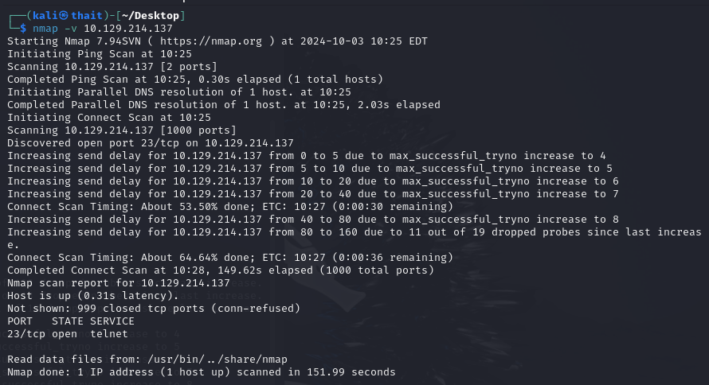

# Meow
- Difficulty: Very easy

## Connect to the machine
1. First, ensure you are connected to the Hack The Box network by configuring your VPN: `sudo openvpn [your-config-file.ovpn]`
2. Spawn the Meow machine from the HTB dashboard. You will be assigned a target IP address.

## Task Breakdown
**1. What does the acronym VM stand for?**  
- **Answer:** Virtual Machine  

**2. What tool do we use to interact with the operating system in order to issue commands via the command line, such as the one to start our VPN connection? It's also known as a console or shell.**  
- **Answer:** Terminal  
  
**3. What service do we use to form our VPN connection into HTB labs?**  
- **Answer:** OpenVPN  

**4. What tool do we use to test our connection to the target with an ICMP echo request?**  
- **Answer:** Ping
- You can run `ping [IP-Address]` to test connection with the target machine

**5. What is the name of the most common tool for finding open ports on a target?**  
- **Answer:** Nmap

**6. What service do we identify on port 23/tcp during our scans?**  
- To identify port and service  of the target machine, you can run `nmap -v [IP-Address]` 

- **Answer:** Telnet

**7. What username is able to log into the target over telnet with a blank password?**  
- We know that the machine is running `telnet` service, now run `telnet [IP-Address]` and we will have a login page.
- It asks us to enter a username to login. Simply, we can use `root`, `admin` or `administrator` to check.  
- **Answer:** root

## Submit the flag
- At the login prompt, entering root as the username grants us access to the machine without a password.
- Run simple command like `ls`, we can see it has a `flag.txt` file. Open it with `cat flag.txt`, the flag should be there.

- **My flag:** b40abdfe23665f766f9c61ecba8a4c19

