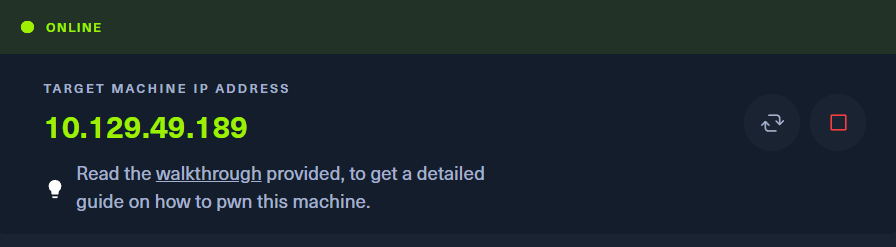
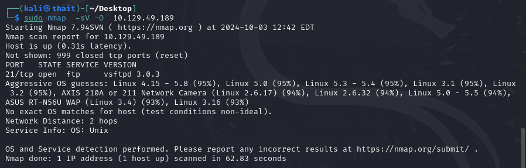
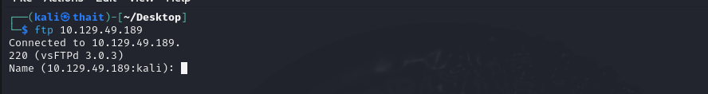
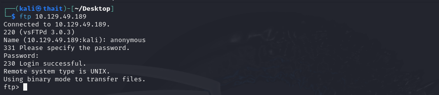
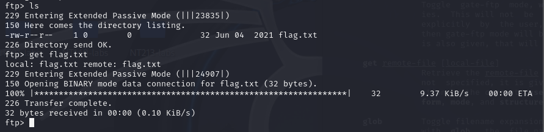
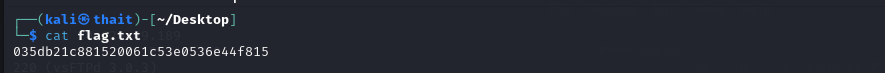

# Fawn
- Difficulty: Very easy

## Connect to the machine
1. First, ensure you are connected to the Hack The Box network by configuring your VPN: `sudo openvpn [your-config-file.ovpn]`
2. Spawn the Pawn machine from the HTB dashboard. You will be assigned a target IP address.

## Task Breakdown
**1. What does the 3-letter acronym FTP stand for?**
>**Answer:** File Transfer Protocol

**2. Which port does the FTP service listen on usually?**
>**Answer:** 21

**3. FTP sends data in the clear, without any encryption. What acronym is used for a later protocol designed to provide similar functionality to FTP but securely, as an extension of the SSH protocol?**
>**Answer:** SFTP

**4. What is the command we can use to send an ICMP echo request to test our connection to the target?**
>**Answer:** ping

**5. From your scans, what version is FTP running on the target?**
- To know the version of service and OS type running on the targer, we can run `sudo nmap -sV -O [IP-Address]`.
>**Answer:** vsftpd 3.0.3

**6. From your scans, what OS type is running on the target?**
>**Answer:** Unix

**7. What is the command we need to run in order to display the 'ftp' client help menu?**
>**Answer:** ftp -h
- Now let's try to run `ftp [IP-Address] to see what's happen.
  

**8. What is username that is used over FTP when you want to log in without having an account?**
- I searched *"FTP anonymous login"* in the Internet and [this one](https://stackoverflow.com/questions/3936911/how-can-i-login-anonymously-with-ftp-usr-bin-ftp#:~:text=Anonymous%20ftp%20logins%20are%20usually%20the%20username%20'anonymous') helps =)))
>**Answer:** anonymous

**9. What is the response code we get for the FTP message 'Login successful'?**
- Let's login with  username `anonymous` and password `anonymous@domain.com`
>**Answer:** 230

**10. There are a couple of commands we can use to list the files and directories available on the FTP server. One is dir. What is the other that is a common way to list files on a Linux system.**
>**Answer:** ls
- After running `ls`, we will see a `flag.txt` file.

**11. What is the command used to download the file we found on the FTP server?**
>**Answer:** get
- Download `flag.txt` using `get flag.txt`

## Submit the flag
- Open `flag.txt` and we will have the flag

- **My flag:** 035db21c881520061c53e0536e44f815

