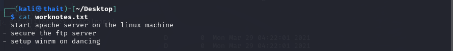

# Dancing
- Difficulty: Very easy

## Connect to the machine
1. First, ensure you are connected to the Hack The Box network by configuring your VPN: `sudo openvpn [your-config-file.ovpn]`
2. Spawn the machine from the HTB dashboard. You will be assigned a target IP address.

## Task Breakdown
**1. What does the 3-letter acronym SMB stand for?**
- **Answer:** Server Message Block

**2. What port does SMB use to operate at?**
- **Answer:** 445

**3. What is the service name for port 445 that came up in our Nmap scan?**
- Run `sudo nmap -sV [IP-Address]` to check

- **Answer:** microsoft-ds

**4. What is the 'flag' or 'switch' that we can use with the smbclient utility to 'list' the available shares on Dancing?**
- If we don't know about `smbclient` command, we can  run `man smbclient` for help 

- **Answer:** -L

**5. How many shares are there on Dancing?**
- I try to run `smbclient -L [IP-Address]` and it asks password for `WOROKGROUP\kali`. Linux ofter has defauld username and password as `kali` so I try `kali` and it succeed =))) Now we see 4 sharenames
- **Answer:** 4

**6. What is the name of the share we are able to access in the end with a blank password?**
- **Answer:** WorkShares
- To connect to WorkShares, run `smbclient \\\\[IP-Address]\\WorkShares`

**7. What is the command we can use within the SMB shell to download the files we find?**
- **Answer:** get

## Submit the flag
- After connect to WorkShares, list all files using `ls` and there are 2 directory.

- Move to Amy.J and there's `worknotes.txt` file. Download this using `get worknotes.txt`

- Open this file 

- Now do the same with James directory and we'll have a `flag.txt` file

- Luckily when I open this file, we'll a real flag and can submit it😯

- **My flag:** 5f61c10dffbc77a704d76016a22f1664

