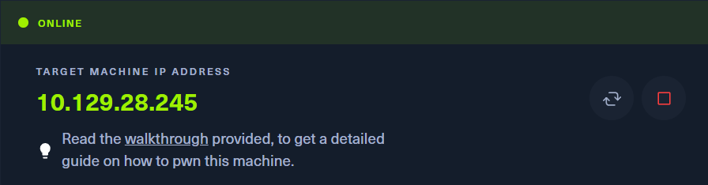
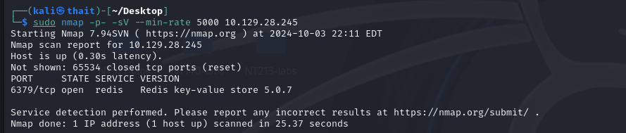
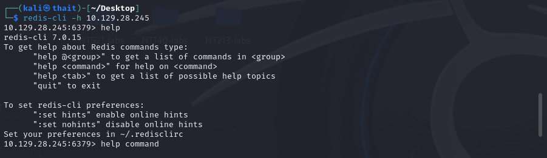
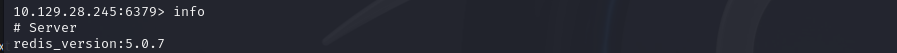
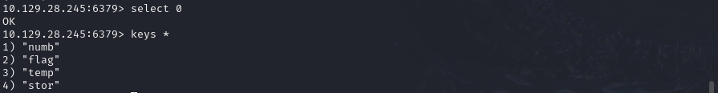
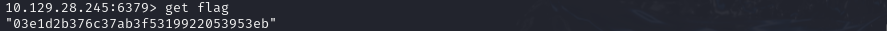

# Redeemer
- Difficulty: Very easy

## Connect to the machine
1. First, ensure you are connected to the Hack The Box network by configuring your VPN: `sudo openvpn [your-config-file.ovpn]`
2. Spawn the machine from the HTB dashboard. You will be assigned a target IP address.  

## Task Breakdown
**1. Which TCP port is open on the machine?**
- To discoveropen ports, run `sudo nmap -p- -sV --min-rate 5000 [IP-Address]`. The `--min-rate 5000` ensures the scan runs faster by sending 5000 packets per second. This can significantly reduce the time needed to scan all 65,535 ports.

>**Answer:** 6379

**2. Which service is running on the port that is open on the machine?**
>**Answer:** Redis

**3. What type of database is Redis? Choose from the following options: (i) In-memory Database, (ii) Traditional Database**
>**Answer:** In-memory Database

**4. Which command-line utility is used to interact with the Redis server? Enter the program name you would enter into the terminal without any arguments.**
>**Answer:** Redis-cli

**5. Which flag is used with the Redis command-line utility to specify the hostname?**
>**Answer:** -h
- Now let's connect to Redis server using `redis-cli -h [IP-Address]`. Once connected, you can type `help` to see available commands.

**6. Once connected to a Redis server, which command is used to obtain the information and statistics about the Redis server?**
- Use the `info` command to retrieve details about the server.

>**Answer:** Info

**7. What is the version of the Redis server being used on the target machine?**
- After running `info`, look for the Redis version in the output.

>**Answer:** 5.0.7

**8. Which command is used to select the desired database in Redis?**
>**Answer:** select
- The `select` command is used to switch between databases. To select the database with index 0, run `select 0`

**9. How many keys are present inside the database with index 0?**
- After selecting database, we can list all keys using `keys *`

>**Answer:** 4

**10. Which command is used to obtain all the keys in a database?**
>**Answer:** keys *

## Submit the flag
- To retrieve the flag, run `get flag` and the flag will be displayed as output.

- **My flag:** 03e1d2b376c37ab3f5319922053953eb

