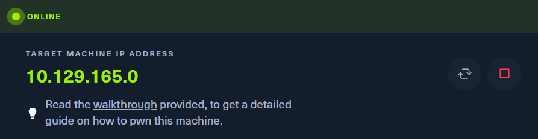
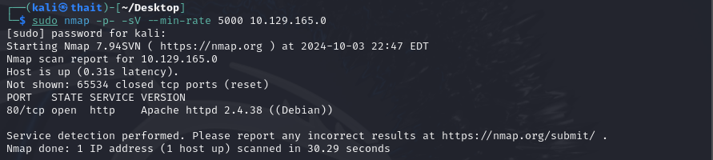
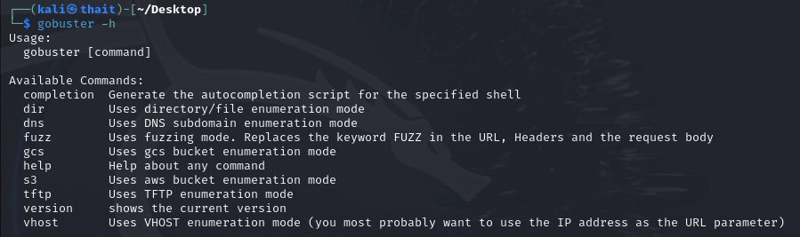
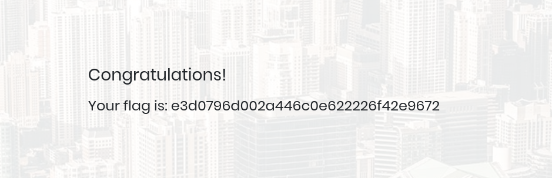

# Appointment
- Difficulty: Very Easy

## Connect to the machine
1. First, ensure you are connected to the Hack The Box network by configuring your VPN: `sudo openvpn [your-config-file.ovpn]`
2. Spawn the machine from the HTB dashboard. You will be assigned a target IP address.

## Task Breakdown
**1. What does the acronym SQL stand for?**
>**Answer:** Structured Query Language

**2. What is one of the most common type of SQL vulnerabilities?**
>**Answer:** SQL Injection

**3. What is the 2021 OWASP Top 10 classification for this vulnerability?**
>**Answer:** A03:2021-Injection
- You can learn more about this vulnerability [here](https://owasp.org/Top10/).

**4. What does Nmap report as the service and version that are running on port 80 of the target?**
- To scan open ports and identify services, run `sudo nmap -p- -sV --min-rate 5000 [IP-Address]`.

>**Answer:** Apache httpd 2.4.38 ((Debian))

**5. What is the standard port used for the HTTPS protocol?**
>**Answer:** 443

**6. What is a folder called in web-application terminology?**
>**Answer:** Directory

**7. What is the HTTP response code is given for 'Not Found' errors?**
>**Answer:** 404

**8. Gobuster is one tool used to brute force directories on a webserver. What switch do we use with Gobuster to specify we're looking to discover directories, and not subdomains?**
- Install Gobuster by running `sudo apt install gobuster`. Use the `-h` option to see all available switches..

>**Answer:** dir

**9. What single character can be used to comment out the rest of a line in MySQL?**
>**Answer:** #

**10. If user input is not handled carefully, it could be interpreted as a comment. Use a comment to login as admin without knowing the password. What is the first word on the webpage returned?**
- Open the target webpage in your browser by navigating to [IP-Address]. You will see a login form.
- To bypass the password, enter `admin '#` as the username and any value for the password. The `'#` part acts as a comment, causing the password check to be ignored.

>**Answer:** Congratulations

## Submit the flag
- **My flag:** e3d0796d002a446c0e622226f42e9672

