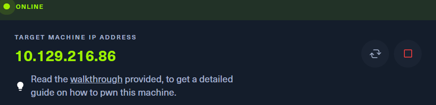
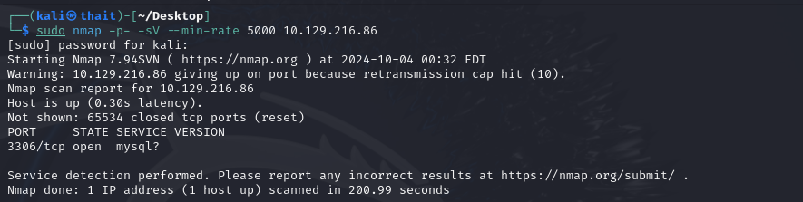
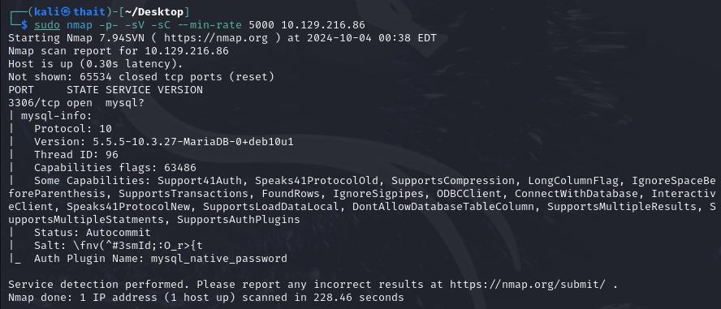
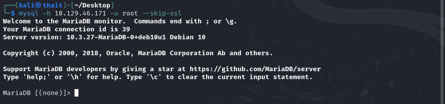
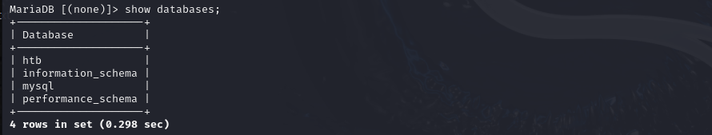
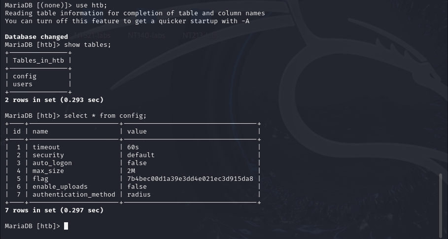

# Sequel
- Difficulty: Very easy

## Connect to the machine
1. First, ensure you are connected to the Hack The Box network by configuring your VPN: `sudo openvpn [your-config-file.ovpn]`
2. Spawn the machine from the HTB dashboard. You will be assigned a target IP address.

## Task Breakdown
**1. During our scan, which port do we find serving MySQL?**
- To scan ports, run `sudo nmap -p- -sV --min-rate 5000 [IP-Address]`.

> **Answer:** 3306

**2. What community-developed MySQL version is the target running?**
- Although the `-sV` in Nmap helps identify services and their versions, it might not always return complete information. Adding the `-sC` (which runs default NSE scripts) can provide more details: `sudo nmap -p- -sV -sC --min-rate 5000 [IP-Address]`

> **Answer:** MariaDB

**3. When using the MySQL command line client, what switch do we need to use in order to specify a login username?**
> **Answer:** -u

**4. Which username allows us to log into this MariaDB instance without providing a password?**
> **Answer:** root
- You can log into the MariaDB instance using the root user without a password by `mysql -h [IP-Address] -u root`, but if you encounter error like `ERROR 2026 (HY000): TLS/SSL error: SSL is required, but the server does not support it`, add `--skip-ssl` option.  

**5. In SQL, what symbol can we use to specify within the query that we want to display everything inside a table?**
> **Answer:** *

**6. In SQL, what symbol do we need to end each query with?**
> **Answer:** ;

**7. There are three databases in this MySQL instance that are common across all MySQL instances. What is the name of the fourth that's unique to this host?**
- Run `show databases;` to show all databases. By default, MySQL includes `sys`, `information_schema` and `performance_schema` databases. More information [here](https://dataedo.com/kb/databases/mysql/default-databases-schemas#:~:text=Every%20MySQL%20is%20shipped%20with%20default%20system%20schemas/databases.). However, there's an additional database unique to this host, named `htb`.

> **Answer:** htb

## Submit the flag
- To access to the `htb` database, use `use htb;`. Once inside the htb database, list its tables with `show tables;`. You will see 2 tables:`users` and `config`. Show all contents of each tables using `SELECT * FROM [table-name]` and we'll have the flag.

- **My flag:** 7b4bec00d1a39e3dd4e021ec3d915da8

