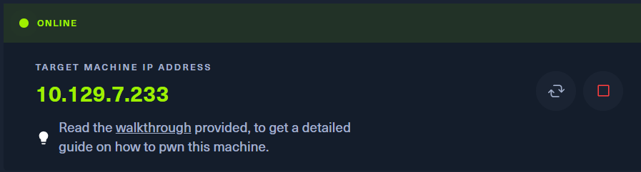

# Crocodile
- Difficulty: Very easy 

## Connect to the machine
1. First, ensure you are connected to the Hack The Box network by configuring your VPN: `sudo openvpn [your-config-file.ovpn]`
2. Spawn the machine from the HTB dashboard. You will be assigned a target IP address.

## Task Breakdown
**1. What Nmap scanning switch employs the use of default scripts during a scan?**
> **Answer:** -sC

**2. What service version is found to be running on port 21?**
- Run `sudo nmap -p- -sV -sC --min-rate 5000 [IP-Address]` to scan ports and services.

> **Answer:** vsftpd 3.0.3

**3. What FTP code is returned to us for the "Anonymous FTP login allowed" message?**
- Connect to the FTP server using `ftp [IP-Address]`.
- When prompted for a username, enter `anonymous` to log in. Once logged in, the FTP server will return a response with code `230`.

> **Answer:** 230

**4. After connecting to the FTP server using the ftp client, what username do we provide when prompted to log in anonymously?**
> **Answer:** Anonymous

**5. After connecting to the FTP server anonymously, what command can we use to download the files we find on the FTP server?**
> **Answer:** get

**6. What is one of the higher-privilege sounding usernames in 'allowed.userlist' that we download from the FTP server?**
- First, list all files on FTP server using `ls`. We will have 2 files, then download them with `get`.

- After downloading, use `cat` to see their contents.

> **Answer:** admin

**7. What version of Apache HTTP Server is running on the target host?**
- The Nmap scan from earlier will also show the Apache version running on the server.
> **Answer:** Apache httpd 2.4.41

**8. What switch can we use with Gobuster to specify we are looking for specific filetypes?**
- We know that file's extension is also reflected file's type.
- Run `gobuster dir -h` to show some help.

> **Answer:** -x

**9. Which PHP file can we identify with directory brute force that will provide the opportunity to authenticate to the web service**
- We see the answer of this question end with **p**, so it might be a `php` file. Let's try with `gobuster dir -u http://[IP-Address] -w /usr/share/dirb/wordlists/common.txt -x .php`.

> **Answer:** login.php

## Submit the flag
- Open the target in your web browser: `http://10.129.7.233/login.php`, then it will show you a login form. Use the credentials you retrieved from the FTP server (`admin` for the username and `rKXM59ESxesUFHAd` for the password).

- After logging in, you will be redirected to a dashboard where the flag is displayed.

- **My flag:** c7110277ac44d78b6a9fff2232434d16

