# Three
- Difficulty: Very easy

## Connect to the machine
1. First, ensure you are connected to the Hack The Box network by configuring your VPN: `sudo openvpn [your-config-file.ovpn]`
2. Spawn the machine from the HTB dashboard. You will be assigned a target IP address.
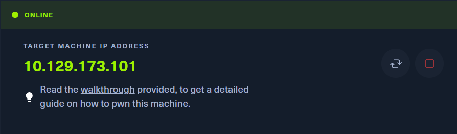

## Task Breakdown
**1. How many TCP ports are open?**
- Perform ports scan using `sudo nmap -p- -sV -sC --min-rate 5000 [IP-Address]`
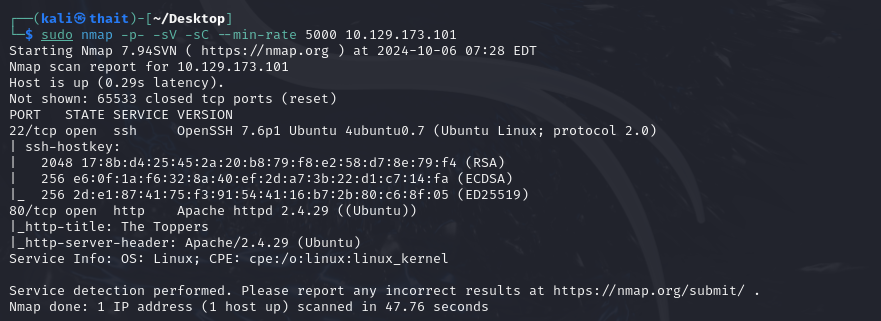
> **Answer:** 2

**2. What is the domain of the email address provided in the "Contact" section of the website?**
- Open the target IP in a web browser, scroll down to the Contact section, and we'll have an email.
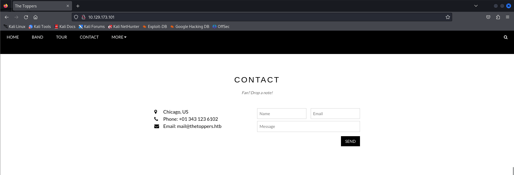
> **Answer:** thetoppers.htb

**3. In the absence of a DNS server, which Linux file can we use to resolve hostnames to IP addresses in order to be able to access the websites that point to those hostnames?**
> **Answer:** /etc/hosts
- Add the IP address to this fileby running `sudo nano /etc/hosts`.
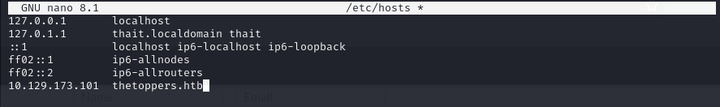

**4. Which sub-domain is discovered during further enumeration?**
- Use a [SecLists](https://github.com/danielmiessler/SecLists) wordlist with thhe following command `gobuster vhost --append-domain -u http://thetoppers.htb -w /usr/share/wordlists/seclists/Discovery/DNS/subdomain-topo1million-20000.txt`
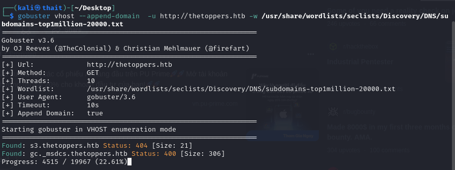
> **Answer:** s3.thetoppers.htb

**5. Which service is running on the discovered sub-domain?**
- Visit `s3.thetoppers.htb` to see a "{status: running}" message. Search for **S3 running status service** to identify that this is Amazon S3.
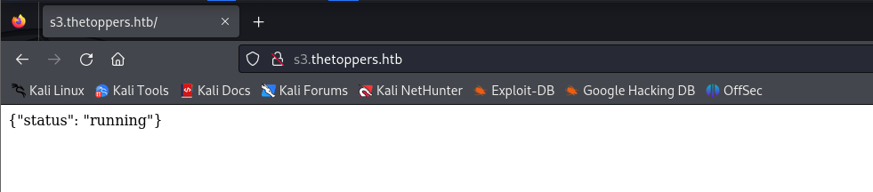.
> **Answer:** Amazon  S3

**6. Which command line utility can be used to interact with the service running on the discovered sub-domain?**
> **Answer:** awscli

**7. Which command is used to set up the AWS CLI installation?**
> **Answer:** aws configure
- Let's run the above command and config with some random data.
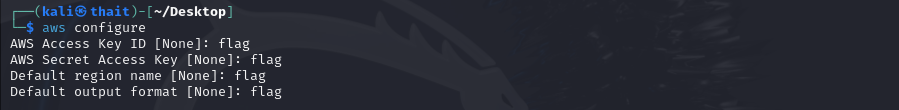

**8. What is the command used by the above utility to list all of the S3 buckets?**
- Run `tldr aws s3` to explore the command options.
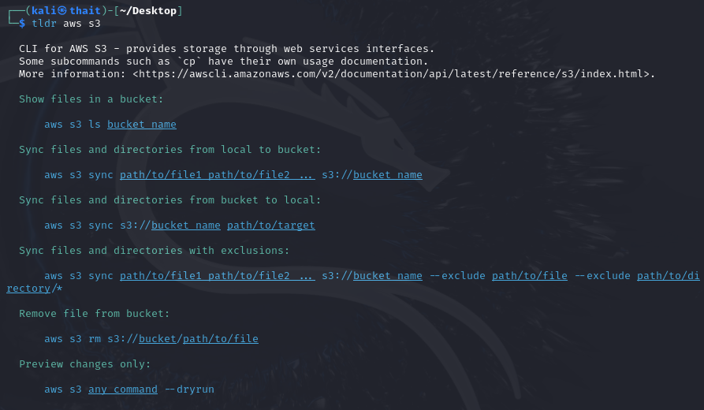
> **Answer:** aws s3 ls

**9. This server is configured to run files written in what web scripting language?**
- Excecute `aws s3 ls --endpoint=http://s3.thetoppers.htb s3://thetoppers.htb`. Here a php file is present, indicating that we can execute PHP files on the system.
> **Answer:** PHP

## Submit the flag
- Create a simple PHP shell for excuting commands
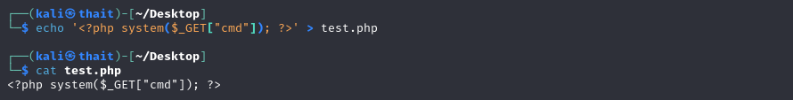
- Upload it with `aws s3  --endpoint=http://s3.thetoppers.htb cp test.php  s3://thetoppers.htb/test.php`
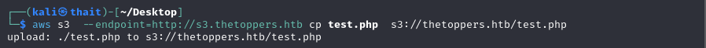
- Modify the URL parameter to execute desired commands

- Remember to replace space with "+" in the URL
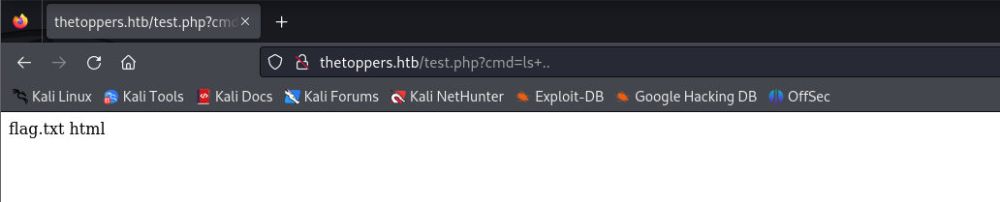
- The flag will be located at `../flag.txt`
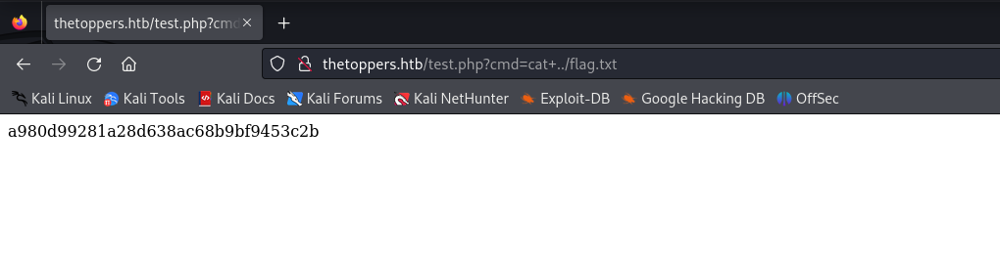
- **My flag:** a980d99281a28d638ac68b9bf9453c2b 

