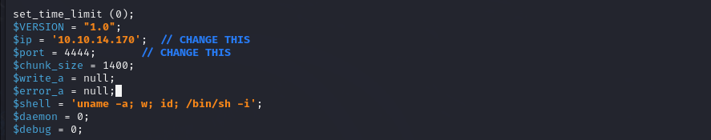

# Oopsie
- Difficulty: Very easy 

## Connect to the machine
1. First, ensure you are connected to the Hack The Box network by configuring your VPN: `sudo openvpn [your-config-file.ovpn]`
2. Spawn the machine from the HTB dashboard. You will be assigned a target IP address.

## Task Breakdown
**1. With what kind of tool can intercept web traffic?**
> **Answer:** proxy

**2. What is the path to the directory on the webserver that returns a login page?**
- Run an Nmap scan to find open ports. Ports 22 (SSH) and 80 (HTTP) are open

- Navitigate to `http://[IP-Address]` which  displays a Welcome page with a reminder **Please login to get access to the service.**

- Viewing the page source with `Ctrl + U` will reveal `` at the bottom  

- Accessing to `http://[IP-Address]/cdn-cgi/login` will lead us to a login page

> **Answer:** /cdn-cgi/login

**3. What can be modified in Firefox to get access to the upload page?**
- "Login as guest" will takes you to the **Admin Panel**, but uploading resources in **Upload** section requires **super admin** right

- Click to **Accounts** section and change URL parameter from  `id=2` to `id=1` will show us `admin` account details.

- When I use **Burp Suite** to follow HTTP history when logging in as guest, I notice that there will be 2 cookies and they are set by user ID and role.

- Change cookies' values in the browser to `admin` and `34322`, and now we will have **super  admin** right to upload.

> **Answer:** cookie 

**4. What is the access ID of the admin user?**
> **Answer:** 34322

**5. On uploading a file, what directory does that file appear in on the server?**
- With admin right, upload a PHP reverse shell
    - Copy shell file to working directory
    
    - Edit IP address and port in the file 
    
    - Upload this file to the server
    
- Run `gobuster dir -u http://[IP-Address] -w /usr/share/dirb/wordlists/small.txt -x php` to find all directories of the server

> **Answer:** /uploads

**6. What is the file that contains the password that is shared with the robert user?**
- Use **netcat** to connect to the target machinne via the uploaded file. If we access to uploaded file via `http://[IP-Address]/uploads/php-reverse-shell.php`, now we can excecute commands on the target machine

- Run `python3 -c 'import pty; pty.spawn("/bin/bash")'` to get a stable shell.
- To list all users, run `cat /etc/passwd` and there's **robert** user.

- Change directory to `var/www/html`- this directory contains all files for a web server. Move to `cdn-cgi` and there are 4 files

- Inspect each file and we'll have `db.php` will contain information about SQL connection (username, password,...)

> **Answer:** db.php

**7. What executible is run with the option "-group bugtracker" to identify all files owned by the bugtracker group?**
- Login as `robert`, run `id` command to check about this user information and notice that **robert** is a part of group `bugtracker`

- Locate `bugtracker` and we will have 2 important notes: `robert` can excecute this file and `root` is its owner.

> **Answer:** find

**8. Regardless of which user starts running the bugtracker executable, what's user privileges will use to run?**
> **Answer:** root

**9. What SUID stands for?**
> **Answer:** set owner user ID

**10. What is the name of the executable being called in an insecure manner?**
- Running `./usr/bin/bugtracker` with any ID wiill always reveal a call to `cat: /root/reports/[ID]`

- Replace `cat` command with a `bin/sh` shell to gain `root` privileges.

- From now on, enter any ID will always  lead us to bin bash shell as `root` user.

> **Answer:** cat

## Submit user flag
- The user flag is located in `home/robert/user.txt`  

- **User flag:** f2c74ee8db7983851ab2a96a44eb7981

## Submit root flag
- The root flag is located at `root/root.txt`
  
- **Root flag:** af13b0bee69f8a877c3faf667f7beacf

